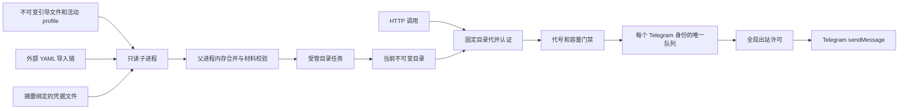

# 运行架构

## 模块职责

`main.rs` 声明 `rest` 路由模块和 `#[nasa::application]` 入口，通过 `app` 调用 `application::install` 装配业务。`lib.rs` 只声明能力模块。REST 认证位于 `rest/auth.rs`，机器人查询与消息受理位于 `rest/bots.rs`，配置状态入口位于 `rest/config.rs`；三个业务接口共用同一认证门禁。

`application/` 管理 napp 初始化及清理登记；`catalog/` 管理配置解析、只读子进程、目录发布和工作者的增删排空；`service/` 处理请求固定代下的授权、选路与一次发送；`partition/` 实现跨代复用的消费队列及预算；`observability/` 从当前目录采集指标。动态工作者由唯一目录管理器持有，不另建应用运行时。

## 配置与发送职责

入口采用 `#[nasa::application("log", "web", "nacos-discovery", config = telegram_bots::catalog::source::bootstrap_loader)]`，由宏生成 runtime、路由装配与进程入口。配置工厂在 preflight 前固定严格解析规则和环境快照，关闭框架自动读取目录 imports，由受管读取进程负责外部 YAML。业务钩子登记统一响应与入口并发边界、指标和 `telegram-catalog` hosted initializer。

1. napp 通过上述配置工厂读取不可变引导文件及活动 profile，并启动基础组件。
2. initializer 在应用统一启动期限内调用隔离读取，确认目录与框架使用的引导快照一致，构建发送资源并登记 `TelegramHandle` 受管资源。
3. `after` 屏障通过 `stage_critical` 暂存目录管理器。所有组件 Ready 成功后由 napp 放行任务，管理器拥有全部发送工作者的 `JoinSet`。
4. `initializer/telegram-catalog/catalog` 就绪贡献表示完整目录已准备。普通候选拒绝保留旧目录和就绪；管理器退出立即撤销就绪与受理权，异常退出触发失败停机。
5. napp 先停止入口与受管任务，再按归属逆序释放初始化资源。指标只保留服务弱引用，不延长业务凭据的资源生命周期。

napp 同时拥有 nalog 日志、Web listener、探针、指标和可选 Nacos 注册发现。日志先建立早期控制台输出，再根据最终引导配置安装可选的文件输出；文件日志在其它业务资源停止后关闭并刷盘。业务不重复安装 subscriber 或创建额外的日志守卫。每个动态机器人消费者归属于唯一目录管理器，不在运行期突破框架的任务注册封口。

业务初始化与每轮运行期读取都由主程序 fork 出一个独立读取子进程，无需另一个可执行文件。子进程只使用异步信号安全的系统调用和无分配的内存操作，执行普通文件的打开、检查、读取和匿名通道传输，不进入 Rust 分配器、日志、解析器或异步运行时。子进程关闭继承的连接描述符，不持有业务 listener；不会再次启动 napp 或注册 Nacos。

父进程按需请求文件字节，再在内存中执行配置合并、占位符解析、摘要校验和候选构造。单文件响应最多 1 MiB，secret 文件最多 513 字节；收到的字节缓冲和候选凭据释放时清零，不把材料写入命令参数、日志或临时文件。每轮只允许一个在途读取者，超时或停止时先终止并回收才允许后续读取。子进程设置四秒存活闹钟，Linux 另设置父进程退出信号；内核阻塞仍受下述回收边界限制。若不能在一秒内确认回收，服务失败停机，不继续累积进程。

引导文件和活动 profile 的首次读取由 napp 同步完成，不属于业务读取超时范围，必须位于可靠本地存储。业务初始化通过隔离读取复验这份不可变引导；两份快照不一致时拒绝启动。内存解析不是可抢占操作，父进程在异步阶段之间响应取消，候选完成时再次检查期限，禁止迟到结果发布；读取预算不构成 CPU 调度或内核回收的硬实时保证。

运行期消费域由目录管理器持有，避免向已经封闭注册窗口的应用容器追加 Runner。队列以 Telegram token 中规范化后的数字身份为 key，而不是 token 文本或业务别名。轮换同一机器人的 token、重命名别名或修改目的地不会并行启动第二个消费者。

## 候选发布

1. 在固定来源边界内重新读取全部导入文件，确认各文件部署代号相同。
2. 合并最终环境覆盖，校验强类型目录、权限、资源预算和引用。
3. 读取 secret 文件并核对 YAML 声明的 SHA-256；再次读取导入链排除来源集合变化。
4. 连续两轮完整候选一致后，解析全部调用方和机器人身份，准备新增队列，复用仍活动的身份队列。
5. 持有与入队相同的权威锁，切换当前代号和目录指针，并关闭已移除队列的受理入口。
6. 为移除队列保留独立排空期限，记录最终发送、失败、未知和丢弃结果。

候选准备不修改有效目录。相同身份仍在排空时拒绝重新加入，等待该消费域退出后重试同一候选。当前与排空中的资源共同受总数及消息预算约束。

请求认证阶段固定 `Arc<Catalog>`，其权限、目的地和材料不会被就地修改。正文读取完成后的入队还要复验应用 Ready 和目录代号。这样，旧凭据认证后长时间上传的请求，也不能在权限已经撤销后继续入队。

已受理消息保留受理当时的机器人材料和目标，既不重新授权，也不改投新目的地。跨代消息共用同一个串行队列、发送时隙与全局 HTTP 限额；发送任务只保留自身所需资源，不把整份历史目录留在队列中。

## 顺序、容量与错误

每个 bot 最多串行进行一次发送；不同 bot 可以并行，受 `max_inflight` 限制。等待发送间隔和平台冷却时不占用 HTTP 许可。业务 HTTP 响应统一为 200，JSON code 表达处理结果；队列满时 code=429，不等待 Telegram 或可用位置。入口并发预算由业务响应层持有，过载同样通过 JSON code=503 表达；健康探针不占用业务预算并保留真实 HTTP 状态。

顺序只覆盖进程内按受理顺序发起请求。超时后平台仍可能迟到处理，因此不能保证异常网络下 Telegram 最终显示顺序，更不能承诺恰好一次投递。

一次受理最多尝试一次 Bot API 请求。HTTP 客户端禁用自动重试、跳转和系统代理。429 平台回执丢弃本条通知，并用 `retry_after` 冷却后续工作；连接失败、明确拒绝与结果未知分别记录。

## 移除与停机

移除先撤下目录与新权限，再关闭队列。已受理消息在移除时设置的期限内继续尝试；因此移除不等于立刻撤销已受理工作。若必须立即禁止旧 token 产生副作用，应在 Telegram 撤销 token，并停止受影响实例。

初始化阶段收到 SIGTERM/SIGINT 时，由 napp 取消初始化并执行已登记的读取清理动作，正常信号停止返回成功退出码；启动期限耗尽或目录无效也进入统一清理。读取进程在初始化 future 被释放后仍有回收所有者。服务运行后由 napp 摘除 readiness 和服务入口；目录任务先撤销受理权并关闭队列，停止候选发布，终止并回收在途读取，再在共享期限内并行排空。已经移除的队列继续受更早期限约束。期限耗尽后取消工作者并等待其释放。外层任务被取消时，同步关闭受理权，任务集合取消所有发送工作者。

终态守卫从受理时开始持有：尚未触发出站即被取消计为 `dropped`，开始出站后未取得明确终态计为 `unknown`。两类计数均保留在进程总量中，移除 bot 后不会消失；重启会清零。不保存消息正文、回执或可恢复工作日志。
