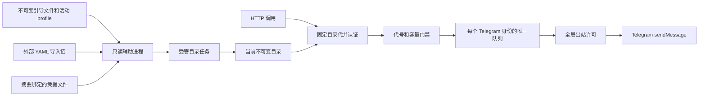

# 运行架构

## 配置与发送职责

NASA 拥有应用 runtime、Web listener、探针、指标和可选 Nacos 注册发现。`CatalogManager` 作为 critical 任务被应用监督，拥有全部发送工作者的 `JoinSet`。工作者异常退出会使服务进入失败停机，不会保留看似可用但没有消费者的队列。

启动预检与每轮运行期读取都使用独立辅助进程；服务父进程不执行目录文件的阻塞读取。辅助角色使用同一个二进制，通过匿名管道接收冻结来源并返回完整候选，没有 listener 或发送职责。管道中的编码缓冲和候选凭据在释放时清零，每条协议消息最多 16 MiB。父进程超时或停止时先终止并回收辅助角色，才允许后续读取；Linux 同时将辅助角色绑定到父进程退出信号。若内核不能在一秒内完成回收，服务失败停机，不继续累积进程。

运行期消费域由本服务管理，避免向已经封闭注册窗口的应用容器追加 Runner。队列以 Telegram token 中规范化后的数字身份为 key，而不是 token 文本或业务别名。轮换同一机器人的 token、重命名别名或修改目的地不会并行启动第二个消费者。

## 候选发布

1. 在固定来源边界内重新读取全部导入文件，确认各文件部署代号相同。
2. 合并最终环境覆盖，校验强类型目录、权限、资源预算和引用。
3. 读取 secret 文件并核对 YAML 声明的 SHA-256；再次读取导入链排除来源集合变化。
4. 连续两轮完整候选一致后，解析全部调用方和机器人身份，准备新增队列，复用仍活动的身份队列。
5. 持有与入队相同的权威锁，切换当前代号和目录指针，并关闭已移除队列的受理入口。
6. 为移除队列保留独立排空期限，记录最终发送、失败、未知和丢弃结果。

候选准备不修改有效目录。相同身份仍在排空时拒绝重新加入，等待该消费域退出后重试同一候选。当前与排空中的资源共同受总数及消息预算约束。

请求认证阶段固定 `Arc<Catalog>`，其权限、目的地和材料不会被就地修改。正文读取完成后的入队还要复验应用 Ready 和目录代号。这样，旧凭据认证后长时间上传的请求，也不能在权限已经撤销后继续入队。

已受理消息保留受理当时的机器人材料和目标，既不重新授权，也不改投新目的地。跨代消息共用同一个串行队列、发送时隙与全局 HTTP 限额；发送任务只保留自身所需资源，不把整份历史目录留在队列中。

## 顺序、容量与错误

每个 bot 最多串行进行一次发送；不同 bot 可以并行，受 `max_inflight` 限制。等待发送间隔和平台冷却时不占用 HTTP 许可。队列满时 REST 返回 429，不等待 Telegram 或可用位置。

顺序只覆盖进程内按受理顺序发起请求。超时后平台仍可能迟到处理，因此不能保证异常网络下 Telegram 最终显示顺序，更不能承诺恰好一次投递。

一次受理最多尝试一次 Bot API 请求。HTTP 客户端禁用自动重试、跳转和系统代理。429 平台回执丢弃本条通知，并用 `retry_after` 冷却后续工作；连接失败、明确拒绝与结果未知分别记录。

## 移除与停机

移除先撤下目录与新权限，再关闭队列。已受理消息在移除时设置的期限内继续尝试；因此移除不等于立刻撤销已受理工作。若必须立即禁止旧 token 产生副作用，应在 Telegram 撤销 token，并停止受影响实例。

启动预检阶段收到 SIGTERM/SIGINT 会终止并回收读取进程，然后非零退出。服务运行后由 NASA 摘除 readiness 和服务入口；目录任务停止候选发布，终止并回收在途读取，再关闭全部队列并在共享期限内并行排空。已经移除的队列继续受更早期限约束。期限耗尽后取消工作者并等待其释放。外层任务被取消时，同步关闭受理权，任务集合取消所有发送工作者。

终态守卫从受理时开始持有：尚未触发出站即被取消计为 `dropped`，开始出站后未取得明确终态计为 `unknown`。两类计数均保留在进程总量中，移除 bot 后不会消失；重启会清零。不保存消息正文、回执或可恢复工作日志。
